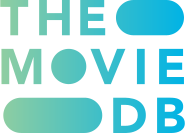

# Project Outline

## Overview
This project is a web application that will utilise the My Anime list API to provide a MAL user (or any user) with a more convenient way to browse and search for anime and manga with a new and improved user interface.

Technologies used:
<ul style="display: flex; flex-direction: row; justify-content: space-evenly; background-color: #333; padding: 1rem; border-radius: 1rem;">
    <li style="list-style: none; margin: auto 0; background-color: #666; padding: 1rem; border-radius: 1rem;"> 
         
    </li>
    <li style="list-style: none; margin: auto 0; background-color: #666; padding: 1rem; border-radius: 1rem;"> 
         
    </li>
    <li style="list-style: none; margin: auto 0; background-color: #666; padding: 1rem; border-radius: 1rem;"> 
         
    </li>
    <li style="list-style: none; margin: auto 0; background-color: #666; padding: 1rem; border-radius: 1rem;"> 
         
    </li>
    <li style="list-style: none; margin: auto 0; background-color: #666; padding: 1rem; border-radius: 1rem;"> 
         
    </li>
</ul>

APIs used:

<ul style="display: flex; flex-direction: row; justify-content: space-evenly; background-color: #333; padding: 1rem; border-radius: 1rem;">
    <li style="list-style: none; margin: auto 0; background-color: #666; padding: 1rem; border-radius: 1rem;"> 
         
    </li>
    <li style="list-style: none; margin: auto 0; background-color: #666; padding: 1rem; border-radius: 1rem;"> 
         
    </li>
</ul>

### Pages

<!-- linke to pretty-mal.muggridge.dev/home -->

[Home](https://pretty-mal.muggridge.dev/home)

2. Anime
    - Search
    - Top
    - Seasonal
3. Manga
    - Search
    - Top

### Components